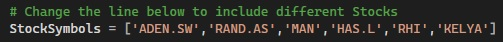
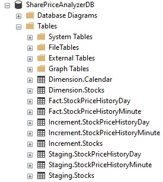

# SharePriceAnalyzer

A tool that collect live Share price data using a Yahoo Finance API and writes to a very simple Kimball Star Schema Datawarehouse in SQL Server.

# Usage
## The Data Collection process

The Python Script `SharePriceAnalyzer.py` call boths the Yahoo API functions and the SQL Server Store Procedures to write the data to the database. To Initiate the process, execute this file.

The Script will initially load daily price history. Then every 60 seconds, the script will load the current quote prices of the stocks. The command Shell window will state the current process.

To stop the Process, simply press and hold the `Esc` key for a couple of seconds until the process outputs `Stopping...` to the shell window.

The process is intially configured to extract Share price information for 6 Largest USA and European Staffing and Recruitment Companies. To change the list of Stocks captuared, simply edit the list as shown below in the `SharePriceAnalyzer.py` file.

## The Database

The Database is a very simply Kimball Star Schema Datawarehouse with Incremental Loading and Staging tables to handle duplicate records collected from the API.

The table `Fact.StockPriceHistoryDay` shows summarised daily information in respect of each Stock whilst `Increment.StockPriceHistoryMinute` show information at each minute throughout the day. Use only Fact and Dimension tables to build any desired reporting.